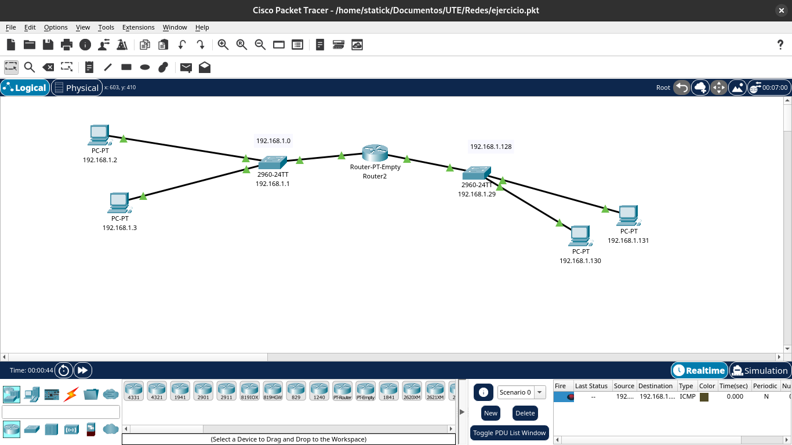

# Laboratorio de Subneteo: Creando y Configurando Dos Subredes

## Objetivo

- Comprender el concepto de subneteo y su aplicación práctica.

- Dividir una red en dos subredes más pequeñas.

- Asignar direcciones IP a cada dispositivo en su subred correspondiente.

- Configurar los dispositivos para que puedan comunicarse dentro de su subred.

## Materiales

- Computadoras con conexión a red

- Sistemas operativos con interfaz de línea de comandos (CLI) o herramientas de configuración de red

- Calculadora de IP (online o software)

- [Hoja de cálculo](https://docs.google.com/spreadsheets/d/1lITEdWuoTQFlLS_tshxjcl0ALTmroLawOj2jNHSHbtk/edit?usp=sharing)

## Procedimiento

### División de la Red

**Dirección de red inicial**: 192.168.1.0

**Máscara de subred original**: /24 (255.255.255.0)

**Número de subredes**: 2

**Número de hosts por subred**: 15

**Nueva máscara de subred**: /25 (255.255.255.128) - Esto nos permite dividir la red en dos partes iguales.

### Creación de la Hoja de Cálculo

| Grupo    | Nombre del Estudiante | Dirección IP  | Máscara de Subred | Puerta de Enlace |
| -------- | --------------------- | ------------- | ----------------- | ---------------- |
| Subred 1 |                       | 192.168.1.1   | 255.255.255.128   |                  |
|          |                       | 192.168.1.2   | 255.255.255.128   |                  |
|          |                       | ...           | ...               | ...              |
|          |                       | 192.168.1.126 | 255.255.255.128   |                  |
| Subred 2 |                       | 192.18.1.128  | 255.255.255.128   |                  |
|          |                       | 192.168.1.129 | 255.255.255.128   |                  |
|          |                       | ...           | ...               | ...              |
|          |                       | 192.168.1.254 | 255.255.255.128   |                  |

## Asignación de Direcciones IP

Cada estudiante elige un nombre y una dirección IP disponible de la subred correspondiente.

## Configuración de los Dispositivos

**Dirección IP**: Configurar la dirección IP asignada en la interfaz de red del dispositivo.

**Máscara de subred**: Configurar la máscara de subred como 255.255.255.128.

**Puerta de enlace**: Si se utiliza un router, configurar la dirección IP del router como puerta de enlace predeterminada.

## Verificación de la Conectividad

- **Ping**: Utilizar el comando ping para verificar si un dispositivo puede comunicarse con otro. Por ejemplo, ping 192.168.1.1 desde otro dispositivo en la misma subred.

- **Comandos de red**: Utilizar comandos como ipconfig (Windows) o ifconfig (Linux) para verificar la configuración de la interfaz de red.

## Explicación

- **¿Por qué dividimos la red en dos?**

**Dividir una red en subredes ofrece múltiples ventajas**:

**Mejor gestión**: Al segmentar la red, resulta más sencillo administrar los dispositivos y el tráfico de red.

**Seguridad**: Las subredes ayudan a aislar diferentes áreas de la red, lo que dificulta la propagación de ataques y mejora la seguridad.

**Eficiencia**: Permite asignar direcciones IP de manera más eficiente, evitando el desperdicio de direcciones.

**Escalabilidad**: Al agregar nuevas subredes, se puede expandir la red sin necesidad de modificar la configuración de toda la red.

**Performance**: Las subredes pueden mejorar el rendimiento de la red al reducir el tráfico en cada segmento.

- **¿Qué significa la máscara de subred 255.255.255.128?**

La máscara de subred es una secuencia de bits que determina qué parte de una dirección IP se utiliza para identificar la red y qué parte se utiliza para identificar el host. En el caso de 255.255.255.128:

**255.255.255**: Indica que los primeros 24 bits de la dirección IP se utilizan para identificar la red.

**128**: Indica que el siguiente bit se utiliza para identificar la subred.

**0**: Los últimos 7 bits se utilizan para identificar el host.

En términos más simples, esta máscara divide la red original en dos subredes iguales.

**Representación binaria**:

11111111.11111111.11111111.10000000

- **¿Cuál es la importancia de la puerta de enlace?**

La puerta de enlace (también conocida como router) es un dispositivo de red que conecta diferentes redes. Su función principal es:

**Enrutamiento**: Determina la mejor ruta para enviar paquetes de datos entre diferentes redes.

**Conectividad**: Permite que los dispositivos en una subred se comuniquen con dispositivos en otras subredes.

**Traducción de direcciones de red (NAT)**: En muchas redes domésticas y pequeñas empresas, el router también actúa como un servidor NAT, permitiendo que múltiples dispositivos compartan una única dirección IP pública.

**Ejemplo**:

Si un dispositivo en la subred 192.168.1.0/25 quiere comunicarse con un dispositivo en Internet, el paquete de datos se envía primero al router (puerta de enlace). El router, al conocer la dirección IP de destino, determina la mejor ruta para enviar el paquete a Internet.

## Conceptos Adicionales

**Dirección de red**: La primera dirección IP disponible en una subred.

**Dirección de broadcast**: La última dirección IP disponible en una subred.

**Rango de direcciones**: El conjunto de direcciones IP utilizables dentro de una subred.

**VLSM (Variable Length Subnet Mask)**: Permite asignar diferentes tamaños de subred a diferentes partes de una red, lo que optimiza el uso de las direcciones IP.

**CIDR (Classless Inter-Domain Routing)**: Un método de direccionamiento IP que reemplazó el sistema de clases de direcciones IP.
